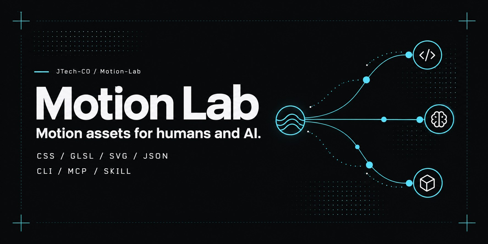
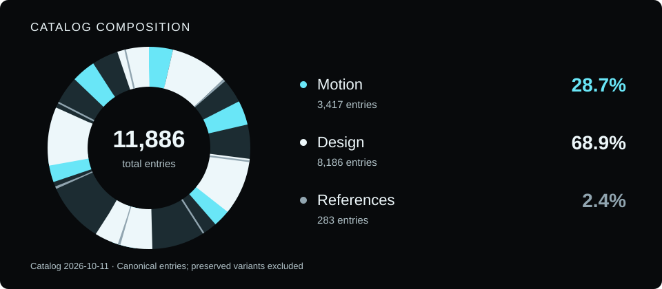

# Motion Lab

[English](README.md) · **한국어**


사람과 AI 도구가 함께 활용하는 모션 코드, 디자인 에셋, 검토 레퍼런스 라이브러리입니다. 로컬 미리보기를 비교하고 효과와 구성 요소로 검색한 뒤, 출처와 라이선스가 포함된 원본 코드나 이미지를 가져올 수 있습니다. MP4 파일 대신 코드, 색상, 이미지를 저장합니다.

<!-- motionlab:catalog-summary:start -->
**저장 에셋 10,001개 + 검토 레퍼런스 285개**, 등록된 출처 160개.
아래 수량은 2026-10-10 카탈로그 기준입니다. 현재 수량은 `python -m motionlab stats`로 확인하세요.

| 자료 모음 | 수량 | 내용 |
| --- | ---: | --- |
| 모션 | 3,345 | 애니메이션, 전환, 타이포그래피, 로더, 인터랙션 효과 |
| 디자인 | 6,656 | 패턴, 형상, 팔레트, 그라디언트, 소재 이미지 |
| 레퍼런스 | 285 | 검토한 예제, 라이브러리, 도구, 사례 연구, 학습 자료 |
<!-- motionlab:catalog-summary:end -->

[GitHub 저장소](https://github.com/JTech-CO/Motion-Lab) · [AI SKILL](skills/motion-lab/SKILL.md) · [CLI, HTTP 및 MCP](docs/interfaces.md)

## 빠른 시작

Git, Python 3.10 이상, FTS5를 지원하는 SQLite가 필요합니다. 탐색, 빌드, CLI, MCP는 Python 표준 라이브러리로 동작하며 API 키가 필요하지 않습니다.

```sh
git clone https://github.com/JTech-CO/Motion-Lab.git
cd Motion-Lab
python scripts/build.py
python -m motionlab serve --port 8787
```

[소개페이지](http://127.0.0.1:8787/) 또는 [라이브러리](http://127.0.0.1:8787/library.html)를 엽니다. 한국어/영어 전환, 마우스 및 방향키/Enter 탐색, 효과와 구성 요소 필터, 페이지당 20/50/100개 보기, 모션 일시정지, 모션 감소 설정을 지원합니다. 로컬 서버는 루프백 주소에서만 접속할 수 있습니다.

```sh
python -m motionlab search --domain motion --effect mask --component image --limit 12 --json
python -m motionlab search --domain design --asset-type pattern --limit 12 --json
python -m motionlab get gl-transitions-drop-zone-flicker --json
```

## 자료 구성



카탈로그 빌드 시 저장 에셋과 검토 레퍼런스의 수량을 읽어 자동으로 갱신합니다. 보존된 원본 변형은 별도 항목으로 중복 계산하지 않습니다.

## AI 도구 연결

**로컬 MCP:** 복제한 프로젝트의 절대 경로에 있는 `motionlab/launch_mcp.py`를 실행합니다. stdio 서버는 `search_motion`, `get_motion`, `motion_stats`를 제공합니다. 아래 예시 경로를 실제 복제 위치로 바꿉니다.

```json
{
  "mcpServers": {
    "motion-lab": {
      "command": "python",
      "args": ["/absolute/path/to/Motion-Lab/motionlab/launch_mcp.py"]
    }
  }
}
```

**SKILL, CLI 및 HTTP:** 포함된 [Motion Lab SKILL](skills/motion-lab/SKILL.md)과 [인터페이스 가이드](docs/interfaces.md)를 활용합니다. 사이트의 **AI 연결** 창에서도 복사 가능한 설정 예시를 제공합니다.

**정적 링크와 JSON:** `dist/`를 정적 사이트로 제공합니다. `/llms.txt`와 `/catalog-index.json`부터 확인한 뒤, `/collections/*.json` 또는 `/catalog.json`에서 필요한 항목을 가져옵니다. 전체 레코드에는 코드, 검증 근거, 라이선스 고지가 포함되어 있습니다. GitHub 및 정적 사이트 URL은 원격 MCP 엔드포인트나 Python API를 제공하지 않습니다.

## 재사용과 출처

라이선스는 **에셋별, 원본 변형별**로 적용됩니다. 코드나 이미지를 재사용할 때 출처 표시와 필요한 라이선스 고지를 유지해야 합니다. 유사 항목은 탐색하기 쉽게 묶되, 원본 ID, 코드, 정확한 색상, 권리 정보를 보존합니다. 변형은 별도의 독립 에셋으로 추가 계산하지 않습니다.

저장 에셋의 미리보기는 지원되는 CSS, GLSL, SVG, 정확한 색상 또는 로컬 소재 이미지를 사용합니다. 레퍼런스 미리보기는 별도의 개념도나 관련 저장 에셋이며, 각각의 권리와 한계가 적용됩니다. 원본 웹사이트를 재현하거나 참조 작품의 사용 권한을 부여하지 않습니다. 분류와 출처 검토는 수집한 코드의 실행 안전성을 보증하지 않습니다.

- [수집, 재빌드 및 패키징](docs/collection.md)
- [분류, 미리보기 및 원본 변형](docs/asset-analysis.md)
- [자체 제작 레시피](docs/recipes.md)

로컬 API와 MCP는 읽기 전용이며 계정, 쿠키, 업로드가 필요하지 않습니다. CLI 출력은 터미널 제어문자를 이스케이프 처리합니다. 휴대용 패키징은 외부 파일 링크를 거부하고, 생성에 실패하면 기존 ZIP을 보존합니다. 입력 검증과 미리보기 보호 기능은 위 가이드에서 확인할 수 있습니다.

`python scripts/package.py`로 휴대용 패키지를 만들 수 있습니다. 선택 기능인 이미지 유사도 검사에만 [추가 Python 패키지](scripts/phase2-requirements.txt)가 필요합니다.
